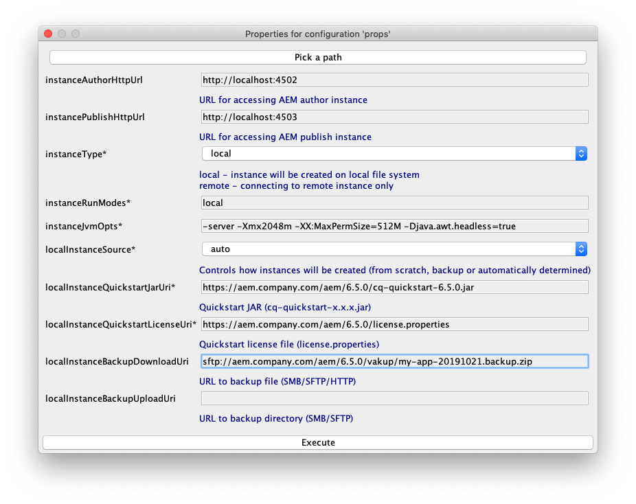

[](https://gradleupdate.appspot.com/Cognifide/gradle-aem-single/status)
[](http://www.apache.org/licenses/)

[](https://github.com/Cognifide/gradle-aem-plugin)

# AEM Boot

This project could be used to **boot local AEM instances and AEM dispatcher automatically**.

As an effect, it sets up:

* <http://we-retail.example.com> - AEM sample content / website.
* <http://author.example.com> - AEM author instance

Automation used in this project is based on [Gradle AEM Plugin](https://github.com/Cognifide/gradle-aem-plugin).

## Table of Contents

* [Quickstart](#quickstart)
* [Environment](#environment)
* [Tooling](#tooling)
* [Extending build](#extending-build)

## Quickstart

1. Clone project using command:

    ```bash
    git clone https://github.com/Cognifide/gradle-aem-boot.git && cd gradle-aem-boot
    ```
    
2. Setup user specific AEM configuration using command:

    ```bash
    sh gradlew props
    ```
    
    and specify properties:

    
    
3. Setup hosts file using command (administrator / super user permissions required):

    ```bash
    sh hosts
    ```    
   
   or on Windows
   ```cmd
   hosts.bat
   ```

4. Setup local AEM instances and environment using command:

    ```bash
    sh gradlew
    ```
   
   or equivalent
   
   ```bash
   sh gradlew setup await
   ```
  
Repeating command above will:

* install new dependent CRX packages defined
* perform new provisioning steps defined

## Environment

Tested on:

* Java 1.8
* Gradle 5.4.1
* Adobe AEM 6.5
* Docker 2.0.0.3

## Tooling

* Generating / updating AEM instance configuration: `sh gradlew props`,
* Monitoring errors in logs: `sh gradlew instanceTail`,
* Copying content between environments/instances: `sh gradlew instanceRcp`,
* Running content migration Groovy scripts: `sh gradlew instanceGroovyEval`.

Review [plugin documentation](https://github.com/Cognifide/gradle-aem-plugin) for more details / how to use tools mentioned above.

## Extending build

For defining new tasks directly in build see:

 * [Build Script Basics](https://docs.gradle.org/current/userguide/tutorial_using_tasks.html)
 * [More about Tasks](https://docs.gradle.org/current/userguide/more_about_tasks.html)

The easiest way to implement custom plugins and use them in project is a technique related with _buildSrc/_ directory.
For more details please read [documentation](https://docs.gradle.org/current/userguide/organizing_build_logic.html#sec:build_sources).
